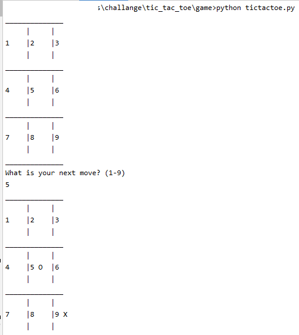
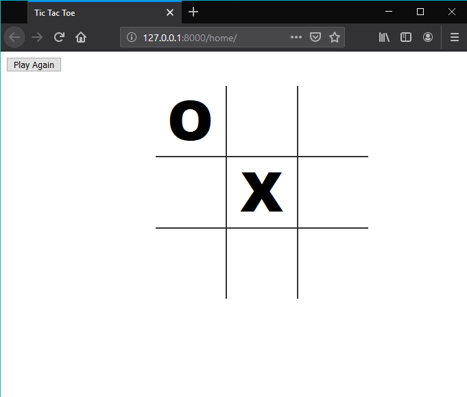

# README #

Tic tac toe permite jugar Tres en raya contra la computadora mediante AI.

### Tic Tac Toe ###

### ¿Cómo jugar? ###

- Ejecutar mediante linea de comandos:
  - Ubicarse en la carpeta _game_
  ```
  cd game
  ```
  - Ejecutar el archivo _tictactoe.py_
  ```
  python tictactoe.py
  ```
  

-  Ejecutar en el navegador :
  - Ubicarse en la carpeta _challange\tic_tac_toe_
  ```
  cd challange\tic_tac_toe
  ```
  - Ejecutar el comando _runserver_ mediante archivo _manage.py_
  ```
  python manage.py runserver
  ```
  


